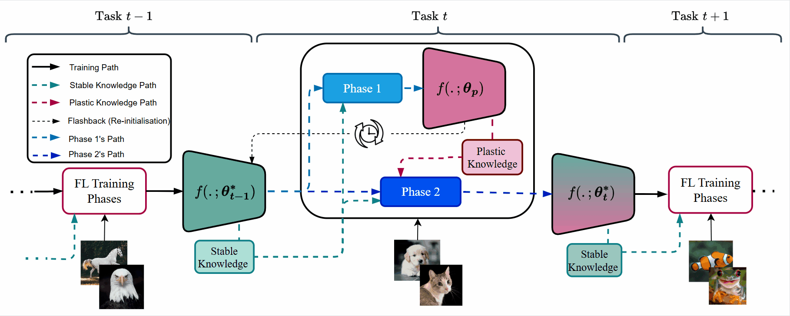
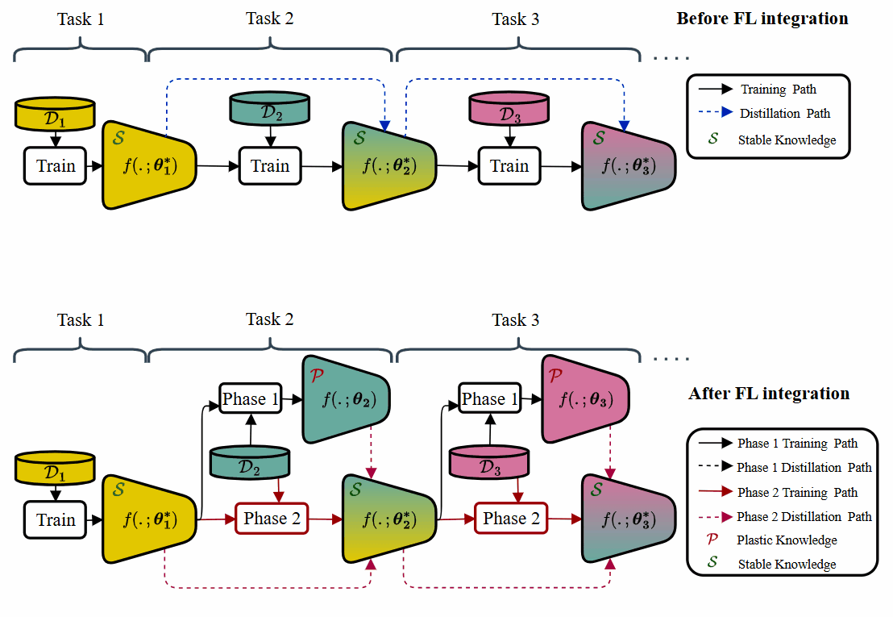
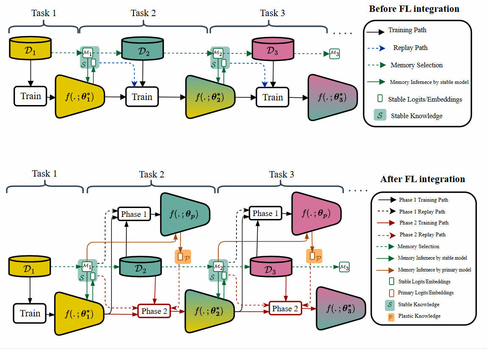
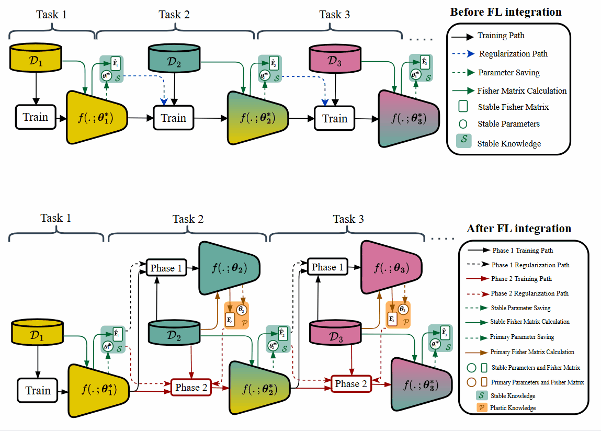

<<<<<<< HEAD
# Flashback-Learning
Flashback-Learning (FL)
=======
<h2 style="font-size:28pt; font-weight:bold;">Flashback to Harmonize Stability and Plasticity in Continual Learning</h2>

<h3 style="font-size:20pt; font-weight:bold; margin-top:30px;">Abstract</h3>

[Read the paper on arXiv](https://arxiv.org/abs/2506.00477)


*Manuscript submitted to Neural Networks (Elsevier) in August 2024 and accepted in May 2025 for publication.*

We introduce Flashback Learning (FL), a novel method designed to harmonize the stability and plasticity of models in Continual Learning (CL). Unlike prior approaches that primarily focus on regularizing model updates to preserve old information while learning new concepts, FL explicitly balances this trade-off through a **bidirectional** form of regularization. This approach effectively guides the model to swiftly incorporate new knowledge while actively retaining its old knowledge.

FL operates through a **two-phase** training process and can be seamlessly integrated into various CL methods, including replay, parameter regularization, distillation, and dynamic architecture techniques. In designing FL, we use two distinct **knowledge bases**: one to enhance plasticity and another to improve stability. FL ensures a more balanced model by utilizing both knowledge bases to regularize model updates.

Theoretically, we analyze how the FL mechanism enhances the stability–plasticity balance. Empirically, FL demonstrates tangible improvements over baseline methods within the same training budget. By integrating FL into at least one representative baseline from each CL category, we observed an average accuracy improvement of up to **4.91%** in Class-Incremental and **3.51%** in Task-Incremental settings on standard image classification benchmarks. Additionally, measurements of the stability-to-plasticity ratio confirm that FL effectively enhances this balance. FL also outperforms state-of-the-art CL methods on more challenging datasets like ImageNet.

For future updates and code releases, please visit our [GitHub repository](https://github.com/csiro-robotics/Flashback-Learning).


<!-- Image with caption (HTML-safe for RMarkdown HTML rendering) -->
<center>

</center>

<p style="font-size:0.95em; text-align:center; margin-top:10px;"><b>Figure:</b> Flashback Learning overview. At task <i>t</i>, <b>Phase 1</b> updates the old model on new data to obtain primary model <i>f(.; θₚ)</i>. Then, it extracts new knowledge and stores it in PKB. <b>Phase 2</b> flashbacks to the old model <i>f(.; θ<sub>t−1</sub><sup>*</sup>)</i>, regularized bidirectionally by stable and plastic knowledge, yielding <i>f(.; θ<sub>t</sub><sup>*</sup>)</i>.</p>

---
<h3 style="font-size:20pt; font-weight:bold; margin-top:30px;">Setting Environment</h3> 


To reproduce the experiments, you need to install the required Python packages. We recommend creating a virtual environment:

```bash
conda create -n flashback-env python=3.9
conda activate flashback-env
pip install -r requirements.txt
```
---


**<span style="font-size:20pt">Datasets</span>** 

### Common Benchmarks

We have used the following common benchmarks in this project:

* **Split-CIFAR10**: A standard benchmark where CIFAR-10 is divided into multiple tasks, typically with 2 classes per task.
* **Split-CIFAR100**: A more challenging version using CIFAR-100, often divided into 10 tasks with 10 classes each.
* **Split-Tiny-ImageNet**: A subset of the ImageNet dataset, split into multiple tasks. It contains 200 classes of tiny resolution images, making it suitable for scalable continual learning evaluation.

### Data Download and Directory

Datasets will be automatically downloaded into the `./data` directory in the root of this project.

> **Note 1**: You can change the data path in the `base_path_dataset()` function located in `utils/conf.py`.
>
> **Note 2**: The `./data` folder will be created automatically if it does not exist.
>
> **Note 3**: For cleanliness and to avoid large file tracking, the `data` folder should not be tracked by Git.

### Customizing Benchmarks

You can customize the structure of each benchmark by modifying the constants used in the corresponding dataset class under the `./datasets/` directory. These constants are:

* `N_CLASSES_TASK_ZERO`: Specifies the number of classes in the first (base) task.
* `N_CLASSES_PER_TASK`: Controls how many classes are introduced per incremental task.
* `N_TASKS`: Determines the total number of tasks to create from the dataset.

For example, in `SequentialCIFAR100` defined in `./datasets/seq_cifar100.py`, the following configuration:

```python
N_CLASSES_TASK_ZERO = 10
N_CLASSES_PER_TASK = 10
N_TASKS = 10
```

defines a benchmark with 10 tasks, each containing 10 classes (standard Split-CIFAR100).

To customize it to a **CIFAR-100-B50-10** setup (50 base classes, 10 classes/task afterward, 6 total tasks):

```python
N_CLASSES_TASK_ZERO = 50
N_CLASSES_PER_TASK = 10
N_TASKS = 6
```

---

**<span style="font-size:20pt">Continual Learning Baselines with Flashback Learning</span>** 

We develop and evaluate **Flashback Learning** across four major categories of CL methods:

1. **Knowledge distillation methods**
2. **Replay memory methods**
3. **Parameter regularization methods**
4. **Architecture expansion methods**

Our experiments demonstrate that FL consistently yields tangible improvements across all these categories, confirming its broad applicability and effectiveness as a plug-in module for continual learning. We show how FL is integrated into eah CL category here:

---
**<span style="font-size:16pt">Knowledge Distillation Methods</span>** 

In distillation-based continual learning, a copy of the old model is retained. When a new task begins, the model is updated on new data while a **distillation loss** encourages it to maintain similarity to the old model’s representations, preserving **stability**.

When Flashback Learning is integrated into this setup:

- **Phase 1**: A primary model is trained on the new task.
- **Phase 2**: The model is reinitialized to the old model and trained using a **bidirectional distillation loss**—from both the old and primary models—guiding the representation toward a balance between past and new knowledge, improving **stability and plasticity**.

We integrate Flashback Learning into two representative **distillation-based** continual learning methods:

1. **Learning a Unified Classifier Incrementally via Rebalancing (LUCIR)**
    is known for applying distillation constraints at the **feature embedding level** (before the final logits) to preserve learned representations. Although it allows replay of a selected exemplar set, its core mechanism relies on distillation [LUCIR – CVPR 2019](https://openaccess.thecvf.com/content_CVPR_2019/papers/Hou_Learning_a_Unified_Classifier_Incrementally_via_Rebalancing_CVPR_2019_paper.pdf).
   The FL-integrated version of LUCIR is implemented in [`./models/fl-lucir.py`](./models/fl-lucir.py).

2. **Learning without Forgetting (LwF.MC)**
    uses distillation at the **logit level**, transferring knowledge from the old model to the current one without replay . We specifically use **LwF.MC**, a multi-class variant adapted from iCaRL [iCaRL – CVPR 2017](https://openaccess.thecvf.com/content_cvpr_2017/papers/Rebuffi_iCaRL_Incremental_Classifier_CVPR_2017_paper.pdf).
   The FL-integrated version of LwF.MC is implemented in [`./models/fl-lwf_mc.py`](./models/fl-lwf_mc.py).

<center>

</center>

---
**<span style="font-size:16pt">Memory Replay Methods</span>** 

In memory replay methods, a memory with limited capacity of previous tasks' samples with their corresponding feature embeddings or logits is selected and brought to new task. When new task begins, the model is updated on a joint distribution of new data and limited kept samples from past. 

When Flashback Learning is integrated into this setup:

- **Phase 1**: A primary model is trained on the new task, and primary new features embeddings or logits are generated for the memory samples by the primary model. 
- **Phase 2**: The model is reinitialized to the old model and trained under a **bidirectional replay**—from both the old and primary logits or feature emebeddings—guiding the model responce towards a balance between past and new knowledge, improving **stability and plasticity**.

We integrate Flashback Learning into two representative **memory replay** methods:

1. **Incremental Classifier and Representation Learning (iCaRL)**
    is a replay method with herding strategy to select samples closest to each class prototype and use them while distilling knowledge from the old model at logits [iCaRL – CVPR 2017](https://openaccess.thecvf.com/content_cvpr_2017/papers/Rebuffi_iCaRL_Incremental_Classifier_CVPR_2017_paper.pdf). The FL-integrated version of iCaRL is implemented in [`./models/fl-icarl.py`](./models/fl-icarl.py).

2. **eXtended Dark Exoerinece Replay (X-DER)**
    is an extension to vanilla [DER – NeurIPS 2020](https://proceedings.neurips.cc/paper/2020/file/b704ea2c39778f07c617f6b7ce480e9e-Paper.pdf), from replay category, that keeps old logits in the memory buffer for distillation during rehearsal. We selected X-DER because it performs better than other DER variations [X-DER – TPAMI 2022](https://ieeexplore.ieee.org/abstract/document/9891836). The FL-integrated version of X-DER is implemented in [`./models/fl-xder.py`](./models/fl-xder.py).

<center>

</center>

---
**<span style="font-size:16pt">Parameter Regularization Methods</span>** 

In parameter regularization methods, parameters and importnace matrix (Fisher information matrix) of old model are stored and brought to new task. When new task starts, the model is updated under a **unidirectional regularization** to learn new task and keep important old parameters. 

When Flashback Learning is integrated into this setup:

- **Phase 1**: A primary model is trained on the new task, its parameters and importance matrix are kept. 
- **Phase 2**: The model is reinitialized to the old model and trained under a **bidirectional regularization**—from both the old and primary parameters—guiding the model paremeters towards an interpolation between old and primary new parameters, improving **stability and plasticity**.

We integrate Flashback Learning into one representative **parameter regularization** methods:

1. **online Elastic Weight Consolidation(oEWC)** 
is a baseline from parameter-regularization category, which calculates old parameters' importance recursively and then apply it for weighted regularization on new parameters update. [Progress and Compress – ICML 2018](https://proceedings.mlr.press/v80/schwarz18a/schwarz18a.pdf). The FL-integrated version of oEWC is implemented in [`./models/fl-ewc_on.py`](./models/fl-ewc_on.py).

<center>

</center>

---

**<span style="font-size:20pt">Run Scripts</span>** 

---

### Running Baselines with and without Flashback Learning 

To run any continual learning baseline with or without **Flashback Learning** integration, use the following command pattern:

```bash
python utils/main.py \
  --run [original | flashback] \
  --model <model_name> \
  --alpha_p <plasticity_loss_scaler> \
  --cl_arguments <arguments_specific_to_cl_baseline> \
  --epoch_base <epochs_for_task0> \
  --sch0 <use_scheduler_for_task0: 0|1> \
  --epoch_cl <phase1_epochs_for_tasks> \
  --sch <use_scheduler_for_phase1: 0|1> \
  --epoch_fl <phase2_epochs_for_tasks> \
  --schf <use_scheduler_for_phase2: 0|1> \
  --dataset <dataset_name> \
  --batch_size <batch_size> \
  --lr <learning_rate> \
  --optim_mom <optimizer_momentum> \
  --optim_wd <optimizer_weight_decay>
```

#### Description of Arguments

* `--run`:
  Set to `original` for running the baseline only, or `flashback` to activate Flashback Learning (FL).

* `--model`:
  Name of the model to run. It must be one of the models that support FL, defined in `models/fl-model.py`.

* `--alpha_p`:
  Scaling factor for the plasticity loss component used in FL Phase 2.

* `--cl_arguments`:
  Baseline-specific arguments required by the continual learning method (e.g., `--e_lambda` for EWC).

* `--epoch_base`:
  Number of training epochs for the base task (task 0).

* `--sch0`:
  Whether to apply a learning rate scheduler during training on the base task. Use `1` to enable or `0` to disable.

* `--epoch_cl`:
  Number of epochs for Phase 1 (task > 0), which trains the primary model on the new task.

* `--sch`:
  Whether to use a scheduler in Phase 1. Set to `1` to enable or `0` to disable.

* `--epoch_fl`:
  Number of epochs for Phase 2 (FL), which flashbacks from the primary model to the old model.

* `--schf`:
  Whether to apply a scheduler during Phase 2. Set to `1` or `0`.

* `--dataset`:
  Name of the dataset. Examples include `seq-cifar10`, `seq-cifar100`, or `seq-tinyimagenet`.

* `--batch_size`:
  Mini-batch size for training.

* `--lr`:
  Learning rate.

* `--optim_mom`:
  Momentum parameter for the optimizer (e.g., SGD).

* `--optim_wd`:
  Weight decay (L2 regularization) used by the optimizer.

> **Note**: You can find ready-to-run scripts for all models supported by Flashback Learning (defined under `models/`) across all datasets in the [`scripts/`](scripts/) folder.

---


## Acknowledgement

We gratefully acknowledge the contributions of the following repositories, which served as the foundation or inspiration for parts of this work:

* [Mammoth: A Flexible Framework for Continual Learning](https://github.com/aimagelab/mammoth)

We thank the authors of these projects for making their code publicly available.
>>>>>>> 1db056f (Initial Commit)
